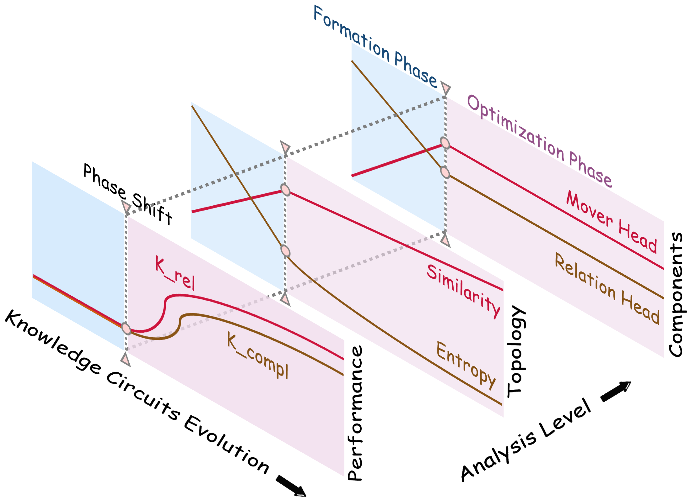

<div align="center">
<h3 align="center">How Do LLMs Acquire New Knowledge?</p>
<h3 align="center">A Knowledge Circuits Perspective on Continual Pre-Training</p>

<h4 align="center">
  <a href="https://zjunlp.github.io/project/DynamicKnowledgeCircuits/">🌐Project</a> •
  <a href="https://arxiv.org/abs/2502.11196">📄Paper</a> •
  <a href="https://huggingface.co/papers/2502.11196">🤗HFPaper</a>
</h4>

[](https://opensource.org/licenses/MIT)
 


---

</div>

## 🔔News

- <strong>[2025-02-16]</strong> We release our paper [How Do LLMs Acquire New Knowledge? A Knowledge Circuits Perspective on Continual Pre-Training](https://arxiv.org/abs/2502.11196).

## 📖Table of Contents

- 🌟[Overview](#overview)
- 🔧[Installation](#installation)
- 🗃️[Dataset-Construction](#%EF%B8%8Fdataset-construction)
- ✏️[Training](#%EF%B8%8Ftraining)
- 🔍[Curcuit-Discovery](#circuit-discovery)
- 🤔[Curcuit-Evaluation](#circuit-evaluation)
- 📊[Analysis](#analysis)
- 🌻[Acknowledgement](#acknowledgement)
- 🚩[Citation](#citation)

---

## 🌟Overview

Despite exceptional capabilities in knowledge-intensive tasks, Large Language Models (LLMs) face a critical gap in understanding how they internalize new knowledge, particularly how to structurally embed acquired knowledge in their neural computations. We address this issue through the lens of Knowledge Circuits Evolution, identifying computational subgraphs that facilitate knowledge storage and processing.

Our systematic analysis of circuit evolution throughout continual pre-training reveals several key findings:
- <strong>[Performance-level]</strong> The acquisition of new knowledge is influenced by its relevance to pre-existing knowledge.
- <strong>[Topology-level]</strong> The evolution of knowledge circuits exhibits a distinct phase shift from formation to optimization
- <strong>[Components-level]</strong> The evolution of knowledge circuits follows a deep-to-shallow pattern.

These insights not only advance our theoretical understanding of the mechanisms of new knowledge acquisition in LLMs, but also provide potential implications for improving continual pre-training strategies to enhance model performance.

<div align="center">
  
</div>

## 🔧Installation

```bash
git clone https://github.com/zjunlp/DynamicKnowledgeCircuits
cd DynamicKnowledgeCircuits
pip install -r requirements.txt
```

## 🗃️Dataset-Construction

**Step1:** Generate the knowledge entities with different types and frequencies.

```bash
python data/datapoint_generation.py
```

**Step2:** Convert the knowledge entities into biography segments.

```bash
python data/text_data_generation.py
```

**Step3:** Generate the test set for the evaluation of models and knowledge circuits.

```bash
python data/query_data_generation.py
python data/circuits_data_generation.py
```

## ✏️Training

Run the continual pre-training process with the following command:

```bash
bash scripts/$model/train.sh
```
> Note: Remember to change `$model` in the script to the name model you want to train, such as `gpt2`, `gpt2-medium`, etc.

Example script for training GPT-2 small model:

```bash
model=gpt2
model_name_or_path=/mnt/8t/oyx/PLMs/${model}  # Change this to the path of the model
train_file=data/entities_50000/train.jsonl
validation_file=data/entities_50000/validation.jsonl
CUDA_VISIBLE_DEVICES=0,1 python train.py \
    --model $model \
    --model_name_or_path $model_name_or_path \
    --tokenizer_name $model_name_or_path \
    --train_file $train_file \
    --validation_file $validation_file \
    --load_data_from_cache False \
    --block_size 1024 \
    --output_dir outputs/train/$model/$(date +"%Y-%m-%d-%H-%M-%S")/checkpoints \
    --do_train \
    --do_eval \
    --eval_strategy steps \
    --per_device_train_batch_size 16 \
    --per_device_eval_batch_size 16 \
    --gradient_accumulation_steps 4 \
    --learning_rate 1e-3 \
    --weight_decay 0.1 \
    --adam_beta1 0.9 \
    --adam_beta2 0.95 \
    --adam_epsilon 1e-6 \
    --num_train_epochs 25 \
    --lr_scheduler_type constant \
    --logging_dir outputs/train/$model/$(date +"%Y-%m-%d-%H-%M-%S") \
    --logging_strategy steps \
    --logging_steps 50 \
    --save_strategy epoch \
    --report_to wandb
```

## 🔍Circuit-Discovery

Run the circuit discovery process with the following command:

```bash
bash scripts/$model/eap.sh
```
> Note: Remember to change `$model` in the script to the name model you want to train, such as `gpt2`, `gpt2-medium`, etc.

Example script for discovering knowledge circuits in GPT-2 small model:

```bash
model=gpt2
directory_path=outputs/train/gpt2/2024-12-19-22-27-33/checkpoints  # Change this to the path of the directory where the checkpoints are saved
circuit_n=300

for task in "city" "company" "major"; do
    data_file=data/entities_50000/circuit_${circuit_n}/${model}/${task}.jsonl
    for dirname in "$directory_path"/checkpoint-*/; do
        model_path="$dirname"
        for type in "new" "revised"; do
            for frequency in "high" "medium" "low"; do
                CUDA_VISIBLE_DEVICES=0 python circuit_discovery.py \
                    --model $model \
                    --model_path $model_path \
                    --task $task \
                    --data_file $data_file \
                    --type $type \
                    --frequency $frequency \
                    --batch_size 64 \
                    --method "EAP-IG"
            done
        done
    done
done
```

## 🤔Circuit-Evaluation

Run the circuit evaluation process with the following command:

```bash
bash scripts/$model/circuit_eval.sh
```
> Note: Remember to change `$model` in the script to the name model you want to train, such as `gpt2`, `gpt2-medium`, etc.

Example script for evaluate knowledge circuits in GPT-2 small model:

```bash
model=gpt2
directory_path=outputs/train/gpt2/2024-12-19-22-27-33/checkpoints  # Change this to the path of the directory where the checkpoints are saved
circuit_n=300

test_data_file=data/entities_50000/test.jsonl

for task in "city" "company" "major"; do
    eval_data_file=data/entities_50000/circuit_${circuit_n}/${model}/${task}.jsonl
    for dirname in "$directory_path"/checkpoint-*/; do
        model_path="$dirname"
        for source_type in "new" "revised"; do
            for source_frequency in "high" "medium" "low"; do
                target_type=$source_type
                for target_frequency in "high" "medium" "low"; do
                    CUDA_VISIBLE_DEVICES=0 python circuit_eval.py \
                        --model $model \
                        --model_path $model_path \
                        --task $task \
                        --eval_data_file $eval_data_file \
                        --test_data_file $test_data_file \
                        --source_type $source_type \
                        --source_frequency $source_frequency \
                        --target_type $target_type \
                        --target_frequency $target_frequency \
                        --batch_size 64 \
                        --method "EAP-IG" \
                        --topn 8000   # Change this to the number of edges that retained in the circuit
                done
            done
        done
    done
done
```

## 📊Analysis

See notebooks in the `analysis/` directory for the visualization analysis of the knowledge circuits.

## 🌻Acknowledgement

The code in this work is built on top of the projects of [transformer_lens](https://github.com/TransformerLensOrg/TransformerLens), [EAP-IG](https://github.com/hannamw/EAP-IG) and [KnowledgeCircuits](https://github.com/zjunlp/KnowledgeCircuits). Thanks for their great contributions!

## 🚩Citation

```bibtex
@misc{ou2025llmsacquirenewknowledge,
    title={How Do LLMs Acquire New Knowledge? A Knowledge Circuits Perspective on Continual Pre-Training}, 
    author={Yixin Ou and Yunzhi Yao and Ningyu Zhang and Hui Jin and Jiacheng Sun and Shumin Deng and Zhenguo Li and Huajun Chen},
    year={2025},
    eprint={2502.11196},
    archivePrefix={arXiv},
    primaryClass={cs.LG},
    url={https://arxiv.org/abs/2502.11196}, 
}
```
